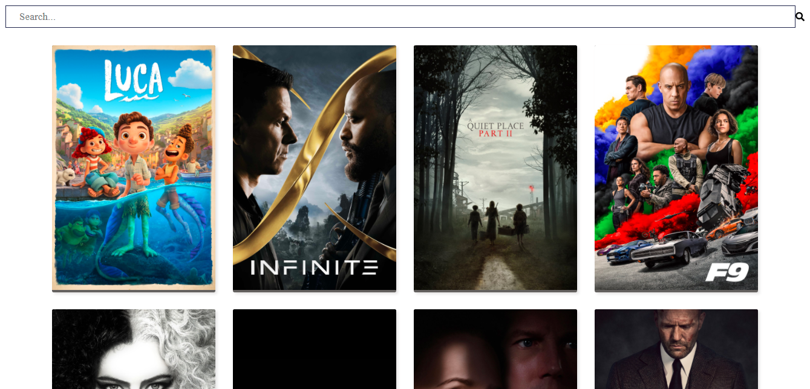
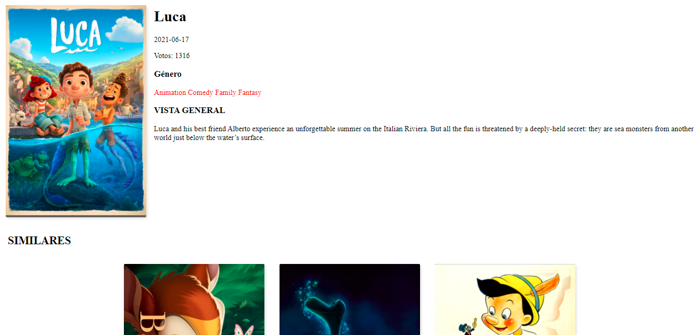

# PRUEBA ECOMSUR REACT

> This application was created in order to search for movies to suit each person, through an api and a search bar, which returns the information, when you click and gives us all the recommendations of each one of them and suggests some of the movies similar to the one wanted raised.
> Live demo [_here_](https://ecomsur-test-a53af.web.app/).

## Table of Contents

- [Technologies Used](#technologies-used)
- [Screenshots](#screenshots)
- [Setup](#setup)

## Technologies Used

- react - version 17.0.2
- react-router-dom - version 5.2.0
- axios - version 0.21.1

## Screenshots




## Setup

To run this project, install it locally using npm:

```
$ npm install
$ npm start
```
